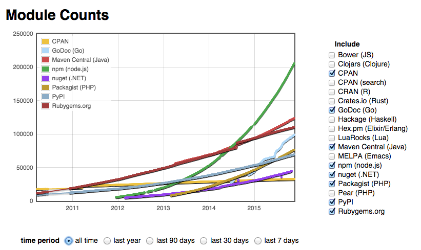
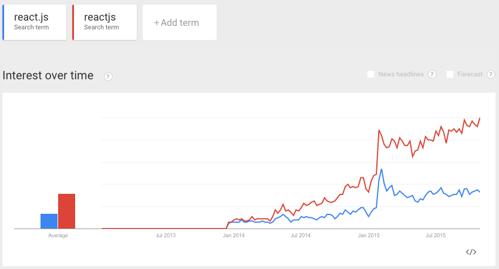

I discussed my [React component boilerplate](FIXME) earlier on. It is focused and deals only with the front-end. That said, often you need to have some sort of back-end in place as well. Frederic Heem's [ES7 StarHackIt](http://starhack.it/) is a solution that aims to solve this problem. Read on to learn more.

## Can you tell a bit about yourself?

  
    
  

I studied industrial engineering in France but ended up being a software engineer for the last the last 15 years mostly in the UK and Italy. Right now, I am working on blockchain and distributed ledger technology in the city of London. During my spare time and when the wind blows, I am hooked on my kitesurf.

  
    
  

## How would you describe StarHackIt to someone who has never heard of it?
*StarHackIt* is a full stack web application boilerplate. The aim is to provide a code base to quickly create new web application. It is a foundation on which software developers can build on top of it. 

This starter kit is written in Javascript *ES6*/*ES7*, it is composed of a frontend based on *React*/*Reflux*, a *Node.js* backend, the data is backed by *SQL* thanks to the *Sequelize ORM*, automatic deployment is done with *Ansible*. The code is built with *Gulp*, analyzed by *ESlint*, tested with *Mocha*, covered by *Istanbul*.

One of the main benefit is that *StarHackIt* comes with *authentication*:

* user can register and login with username and password, reset the password via email.
* social login with Facebook, Google, GitHub etc ... 

A fine grained *authorization* system based on groups, permissions and resources is also provided. This allows to create users belonging to groups with different set of permissions to the API. A simple example is to grant special access to users belonging to the *Admin* group.

## Why did you develop StarHackIt?

Most Javascript boilerplates are not really full stack, either they focuss on the frontend or they specialize on the backend.

The data is almost always stored on non relational *NoSQL* database like *mongodb* or in the cloud with *firebase*. However, most applications rely on relational data so SQL databases as *Postresql* or *MySql* are better suited. Actually, using a NoSQL database when the data are essentially relational could lead to serious issues. 

  
    
  

The *MEAN stack* is quite popular, it's composed of *MongoDB*, *Express*, *Angular* and *Node*. Instead *StarHackIt* is a *SERNA stack*: *SQL*, *Express*, *React*, *Node* and *Ansible*.

The Ruby fans have ruby on rails but the Javacript developers don't have node on rails (yet). This project is a little step towards the direction of a productive javascript web framework.

Image that you have to attend a hackathon to create a useful app in a weekend, is there any time to lose creating from scratch an application with some basic functionalities such as login and register ? 

## What kind of challenges have you experienced while developing it?
The Javascript ecosystem is vibrant with a record number of packages that have overtaken any other languages, see [modulecount](http://www.modulecounts.com/) for the facts.

  
    
  

The challenge is mostly about making choice between these huge numbers of packages to build upon:

* React/Angular/Angular2/Ember/Backbone
* Reflux/Flux/Redux/Alt
* Bootstrap/Material/Foundation
* Eslint/Jscs/Jshint
* Stylus/Saas/Less/CSS
* Express/Koa/Hapi/Strongloop/Sails/Meteor
* SQL/NoSql
* Sequelize/Bookshelf
* Webpack/Browserify/RequiresJs
* Gulp/Grunt
* Ansible/Chef/Puppet
* Mocha/QUnit

It is about selecting the best tools at a given time and integrating them. Over time, new libraries will emerge, other libraries will be unmaintained. Keeping the code up to date with the new version will require some kind of maintenance.

  
    
  

Writing code in *ES6* and *ES7* adds another layer of complexity on the build system since files need to be transpiled to plain old Javascript. This also makes setting up code coverage and testing trickier. It's definitely worth it however.

The most amazing feature with *ES7* is **async/await**, forget about callbacks and Promises, async/await is an enlightenment and the way to go, it makes writing asynchronous code similar to writing synchronous code, it significantly changes the way javascript is written, especially on the node side.

> Twenty years ago JavaScript was a joke, now it's the future. [jster.net september-2015 ](http://jster.net/blog/monthly-jster-september-2015-part-2#.VkPBH2SKH-k)

## What next?
Next is to improve the documentation to explain the various parts of the stack, write a tutorial on how to create the famous TODO app. Then a native mobile app with react-native is definitely on the road map. An admin interface to manage users and other aspects of the app would be also very useful.

## What does the future look like for React and front-end in general? Can you see any particular trends?
The future of React lies in the various flux implementations that are evolving very quickly, React is only a part of the equation for building an application. The React community is growing at fast pace, for instance, the React Meetup in London is fully booked only after 20 minutes upon publication of the event. The frontend development and software in general have a bright and sustainable future, there is no shortage of software development job in sight.

  
    
  

## Who should I interview next?
What about an interview of Juho Vepsäläinen ? The mind behind [jster.net](http://jster.net/)

## Conclusion

JV: I'll fill this. Thanks etc. :)

If you want to look into StarHackIt, consider the following resources:

* [starhack.it](http://starhack.it)
* [source code on GitHub](https://github.com/FredericHeem/starhackit)
